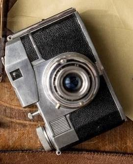

# Feature-detection and Matching

This project aims at exploring and potraying the, the FLANN based Feature Matcher, using SURF. I know I did my last project on making a SIFT(made from scratch), however I didn't find enough resources, for FLANN in SIFT, also because, the Descriptors and Keypoints, generated in my scratch code were, basically, not in the required format for applying the FLANN matching function. Thus, I found the easy way out, and made a completely different file.

The code is mainly inspired from the official openCV site : https://docs.opencv.org/3.4/d5/d6f/tutorial_feature_flann_matcher.html

**The project is important for me, because of the targets that I achieved and things I learnt**:
- Brew Installation
- OpenCV installtion on Macbook, using XCode
- XCode Internal file structuring and linkings
- File paths and binary files of images
- Photo editing and hunting

**NOTE**: If you want to know how to setup openCV on your MacOS, using XCode and HomeBrew, then I have another repository available, named openCV-MacOS-setup.

### The First Original Image:

### The Second(edited) Original Image:

### The Final Result/Feature Matching:

## Observations:
We can observe the fact that the second(edited) image has not only been scaled but also rotated, however irrespective of that, the FLANN matcher using the Descriptors is able to , match the corrosponding points properly. Thus it's able to identify the camera out of the whole image, using SURF. Extraction of keypoints and descriptors in SIFT, can be found in this repo(https://github.com/Daksh-404/SIFT-algo-self).

## Authors
OpenCV Dev Team
